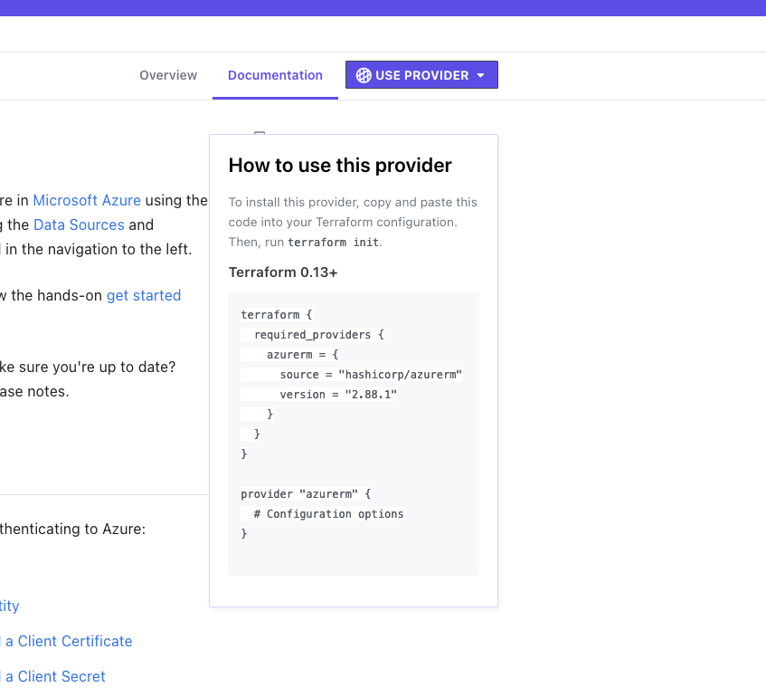

# Create an Azure Virtual Network using Terraform
So I'll start by saying there's already a good amount of content out there on how to create resources in Azure including Virtual Networks or vNETs. The goal is for this to be an extremely simple primer on writing the code to deploy a vNET and its dependent resources as well as configuring a remote state file. Eventually I'd like to build on this including how to approach deploying Terraform code from Azure DevOps Pipelines and more complex deployments. This guide makes a couple of assumptions: 
- You already have an Azure subscription
- You have some understanding of Azure and how resources are organized
- You are somewhat comfortable with the command line
- You have the Azure CLI installed
- You have wget, unzip, and a code editor installed

### Let's get started by installing the Terraform CLI
1. Get the [download of Terraform](https://www.terraform.io/downloads.html) appropriate for your operating system and architecture. I'll use wget to pull down a copy of this on MacOS. The steps are pretty much identical for Linux and WSL on Windows.
2. `wget https://releases.hashicorp.com/terraform/1.0.11/terraform_1.0.11_darwin_amd64.zip` replacing this with the link for the appropriate version for your operating system and architecture.
3. `unzip terraform_1.0.11_darwin_amd64.zip` should extract the Terraform exectuable into your current directory.
4. Make Terraform executable by running `chmod +x terraform`.
5. Now I typically move this to `/usr/local/bin` but you just need to have this in a location that is in your path to make your life easier. `sudo mv /usr/local/bin`
6. Run `terraform -v` to see the version of Terraform installed and validate you can run Terraform successfully.

### How to structure a Terraform project
I typically structure my Terraform projects with the root folder of the project containing the Terraform files (`.tf`) with separate folders for modules, Terraform variable files, and another folder for CI/CD scripts or templates. All of the `.tf` files in the root directory will be considered as a single deployment. You can have all of the resources defined in a single file (typically called `main.tf`) but I prefer to have a file for each type of resource I am deploying so I can reuse pieces between projects. That's how we'll approach it in this guide as well. The name doesn't really matter here but I use the name of the type of resource being described.

### Time for some tf code
Let's create a new directory called `az_vnet`. Then we'll create a new Terraform file called `provider.tf`. We'll put the `terraform` and `provider` blocks here as shown below.
#### provider.tf
```terraform

```
**Let's break this down…**
The `terraform` block is where we'll define our required providers for the project and pin to a specific version. Pinning to a specific version prevents breakage in the future but make sure you are updating this periodically. The `azurerm` provider is frequently updated. You'll specify other providers required as well. A provider in Terraform is simply a plugin that translates the Terraform code into the API calls for the targeted API. Terraform has a marketplace for providers and you could use multiple providers in a single project to deploy a resource in Azure and update a DNS record in Cloudflare using the output information from the Azure resource.

The `provider` block is where you'll specify your `provider` and the configuration.

This `provider.tf` file can be copied found on the [AzureRM provider page](https://registry.terraform.io/providers/hashicorp/azurerm/latest/docs) under the *Use Provider* option. 
#### rg.tf
